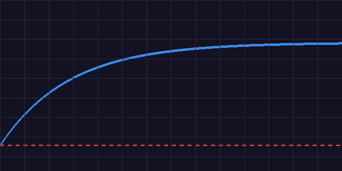
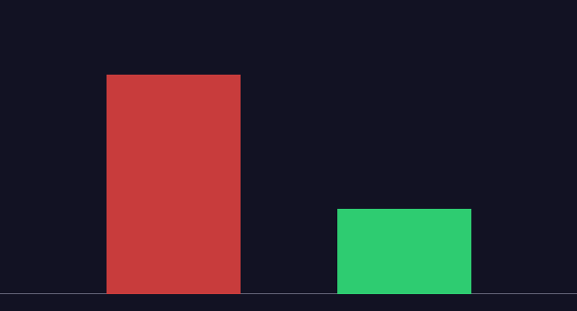

# FORGE-MA: Train LLMs to Investigate Misinformation via Adversarial RL

[](https://huggingface.co/spaces/NeuralHU/forge-rl)
[](training/forge_grpo_colab.ipynb)

> **[▶ Live Environment](https://huggingface.co/spaces/NeuralHU/forge-rl)** |
> **[📓 Training Notebook](training/forge_grpo_colab.ipynb)** |
> **[📝 Blog Post](https://huggingface.co/blog/NeuralHU/forge-rl)**

---

## The Problem

LLMs can classify text. They cannot *investigate*. A human fact-checker
queries sources, checks timelines, cross-references entities, then submits
a verdict. FORGE-MA trains LLMs to do exactly that — structured forensic
investigation as a Markov decision process.

## The Environment

- **9 task types**: fabricated statistics, out-of-context imagery, coordinated
  campaigns, political fact-checks, image forensics, SEC fraud, satire, and more
- **13 actions**: 10 investigation tools + 3 verdict submissions
- **Procedurally generated**: no two episodes are identical
- **Shaped reward**: R = 0.90×correctness + 0.20×efficiency + 0.10×coverage —
  rich signal, not terminal-only

## Results


*GRPO training improves mean episode reward from baseline to trained agent.*


*Quantitative improvement after 3 epochs of GRPO training on T4 GPU (~45 min).*

## Quickstart

```bash
pip install git+https://huggingface.co/spaces/NeuralHU/forge-rl
```

```python
from forge_ma import ForgeEnv, ForgeAction

with ForgeEnv(base_url="https://NeuralHU-forge-rl.hf.space").sync() as env:
    obs = env.reset()
    print(obs.claim_text)              # the claim to investigate
    result = env.step(ForgeAction(action=0))   # query_source
    result = env.step(ForgeAction(action=10))  # submit_verdict_misinfo
    print(result.reward)               # shaped reward signal
```

## Train Your Own Agent
Open [training/forge_grpo_colab.ipynb](training/forge_grpo_colab.ipynb) in
Colab and run all cells. Runs on free T4 GPU in ~45 minutes.

## Why This Matters
Misinformation detection is moving from classifiers to investigative agents.
FORGE-MA provides the training ground: structured forensic reasoning under
budget constraints, with adversarial claim generation. A researcher could
write a paper about an agent trained on this environment.
